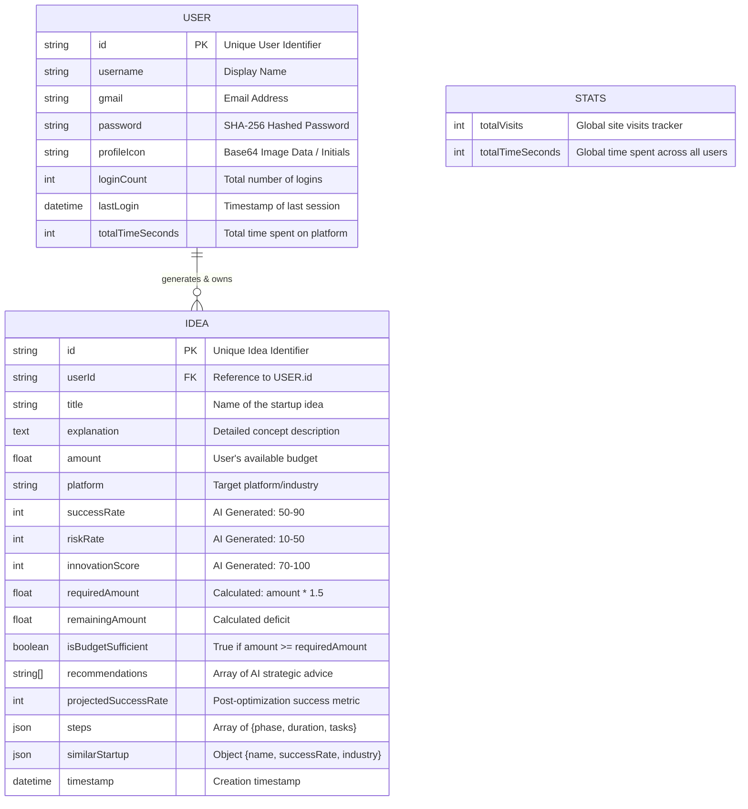

# Startup Incubator AI - Entity Relationship (ER) Diagram

This document outlines the data model and entity relationships for the **Startup Incubator AI** platform. Since the application utilizes a document-based JSON store (`db.json`), the schema maps out the structured JSON objects and their referential links.

## ER Diagram

## Data Dictionary

### 1. `USER`
Represents the registered entrepreneurs on the platform (including guest accounts). 
- **Relationships:** A single `USER` can have zero-to-many (`0..N`) `IDEA`s stored in their history.
- **Notes:** Admin functionality is currently handled via a hardcoded bypass (`kathirvel_admin`), but their time and analytics are aggregated alongside regular users.

### 2. `IDEA`
Represents a generated AI Feasibility Assessment. 
- **Relationships:** Each `IDEA` must belong to exactly one (`1..1`) `USER`. 
- **Notes:** Contains all the financial metrics, generated AI scorings (success, risk, innovation), and nested JSON arrays for the implementation roadmap (`steps`) and competitor analysis (`similarStartup`).

### 3. `STATS`
A singleton system configuration object used for the Admin Dashboard.
- **Relationships:** None. It acts as a global accumulator.
- **Notes:** Tracks raw global metrics like `totalVisits` and `totalTimeSeconds` for high-level administrative reporting.
