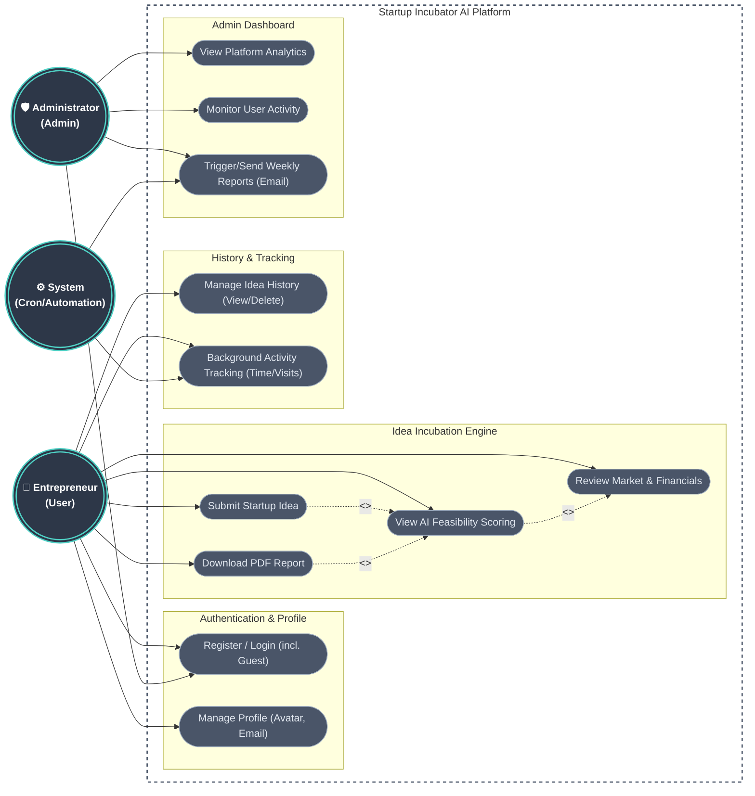

# Startup Incubator AI - Use Case Diagram

This document outlines the professional Use Case Diagram and actor interactions for the **Startup Incubator AI** platform.

## Use Case Diagram

## Actor Definitions

1. **Entrepreneur (User)**: The primary end-user who utilizes the platform to validate startup ideas, view feasibility scores, and download PDF reports.
2. **Administrator (Admin)**: The platform owner who monitors traffic, user engagement, and platform analytics via a secured dashboard.
3. **System (Cron/Automation)**: The automated background processes responsible for tracking time/visits and dispatching automated weekly email reports.

## Key Subsystems & Use Cases

### 1. Authentication & Profile
- **Register / Login**: Users can create an account, log in, or use a guest account. Admins have a dedicated bypass/login.
- **Manage Profile**: Users can update their username, email, and profile avatar.

### 2. Idea Incubation Engine
- **Submit Startup Idea**: Users submit their concept, required funding, and target platform.
- **View AI Feasibility Scoring**: The core feature that calculates Success Probability, Risk Coefficient, and Innovation Score.
- **Review Market & Financials**: Provides insights on Market Potential (TAM, SAM, SOM) and Capital Budget status.
- **Download PDF Report**: Allows users to export their feasibility model as a professionally formatted native PDF.

### 3. History & Tracking
- **Manage Idea History**: Users can access their previously generated reports and permanently delete them.
- **Background Activity Tracking**: The system tracks user session time and overall page visits.

### 4. Admin Dashboard
- **View Platform Analytics**: Aggregates total visits, time spent, and total logins across all users.
- **Monitor User Activity**: Admins can see a breakdown of individual users and the ideas they've generated.
- **Trigger/Send Weekly Reports**: Generates and emails an automated weekly activity report via Nodemailer (both manually triggered by admin and automatically by the cron job).
